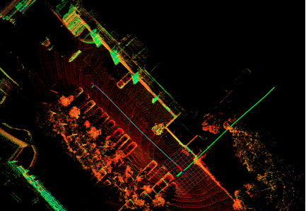
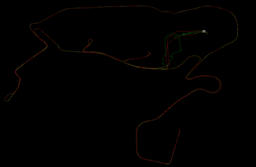
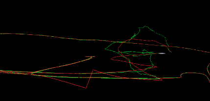
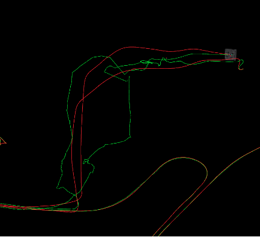
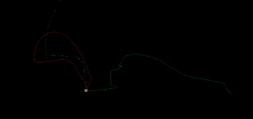

# gps_based_slam
from vins-fusion, only for test

## RUN

```
roslaunch global_fusion debug_gps.launch
```

添加了一个GPS航迹推算的节点，即利用前后GPS坐标点计算其航向角yaw作为轨迹朝向，可以作为真实轨迹的参考。

vins-fusion中做基于GPS位置约束优化SLAM轨迹，注意时间对齐，以及选取一些GPS协方差较小的点，否则整个SLAM轨迹会被拉偏。


## 问题描述

LIO-SAM是一套耦合性较高的系统，后端因子图优化后的odomery会提供给前端点云去畸变使用，很难分离前后端。在整个SLAM系统初始化过程中，采用IMU RAW data的rpy角作为起始第一帧的朝向，初始位置0（默认为初始化的短时间内平移变化量为0），SLAM系统后续估计的所有位姿依赖初始帧朝向来进行递推。而六轴的IMU raw rpy只是一个相对值，和绝对的GPS系之间还有一个朝向的差距，如何去对齐坐标系？如图2-0. 



**图2-0：GPS轨迹(绿色)和SLAM轨迹(蓝色)** 


## 问题分析

在SLAM系统中，世界坐标系一般是采集数据的第一帧确定的，第一帧位姿一般是单位帧或者随机给一个orentation。而GPS平面系是绝对的，即当前笛卡尔系的正北朝向。两者之间存在一个固定的变换。对齐坐标系，可以方便处理以下两件事，一是基于GPS的回环检测，二是基于GPS位置约束的后端优化。一般有以下两种思路， 

（1）认为GPS系到SLAM系的转换是固定不变的，将同步好的GPS初始朝向给SLAM系统作为第一帧的朝向（T_gps2world * T_body2world.inverse() ）, xchu_mapping中是这么实现的。 

（2）认为GPS系到SLAM系的转换是动态变化的，将其作为gps外参的一部分来做优化，相当于GPS轨迹和SLAM轨迹的动态align，vins-fusion中采用此种方案效果不错。 

  

## 测试结果分析

采用（1）方案的LIO-SAM-GPS系统尚未顺利实现，主要原因是其初始化流程非常繁琐，用IMU raw rpy，还涉及到imu odometry的初始xyz。 

 

**图2-1：方案2中轨迹对比**

采用（2）方案的LIO-SAM-GPS系统已实现，但存在一些问题，它和SLAM系统解耦的，在完成mapping后，再做一次基于GPS的优化，在这个过程中完成gps坐标系对齐，因此很难用来做基于gps的闭环检测。UST-CAMPUS dataset中的GPS非RTK，并且误差较大，LLA协方差在10-10-100这个量级。并且数据集初始一小段场景的GPS数据并不太理想，如果把它用作align gps系的话，会导致在后续SLAM过程中，很多质量一般的GPS点用来做位置约束优化，导致整个SLAM轨迹变形或者局部出现问题。 

1）如图2-1，绿色轨迹为gps位置推算计算而来的轨迹，红色为基于GPS位置约束后的SLAM轨迹，发现在**起始位置**GPS数据不好的地方，SLAM轨迹被严重影响。因为我们选取了协方差在14m内的GPS点做优化，**否则整个系统在开始一大段时间内无符合要求的GPS点，无法对齐坐标系，或者原SLAM轨迹被严重拉歪，如图2-4**。此外，同一位置在前后不同时间经过的时候，GPS坐标也不一定固定，信号不好的地方会出现一些跳变，比如起始一小段距离，也会影响局部的SLAM轨迹，如图2-2和2-3。 



图2-2：GPS对齐和优化后的SLAM轨迹局部跳变 



图2-3：起始一小段往返的时候GPS跳变，导致SLAM轨迹拉歪



图2-4：起始一段无符合要求的GPS点，后续对齐整个轨迹变形 


2）初始化的第一帧GPS可能需要精度比较高。 
